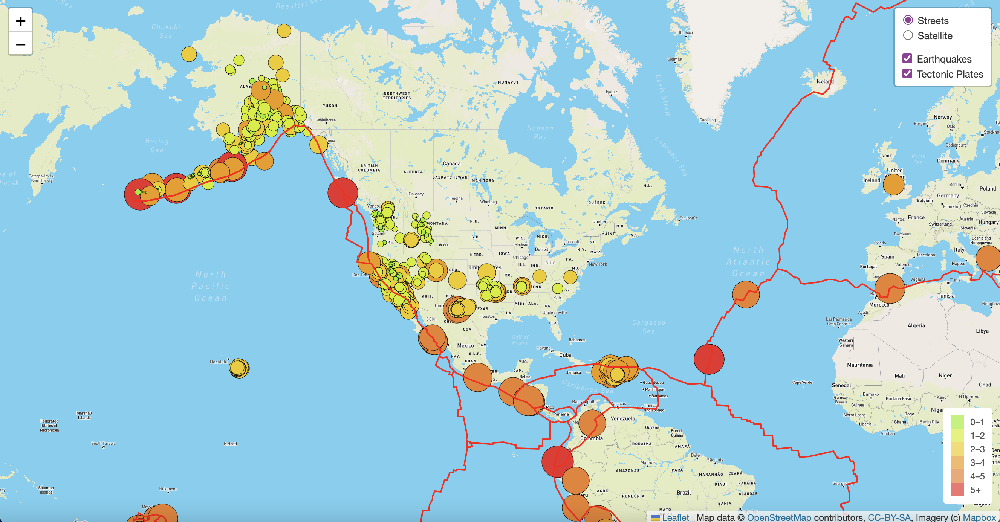
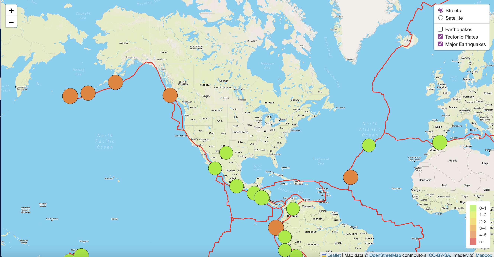
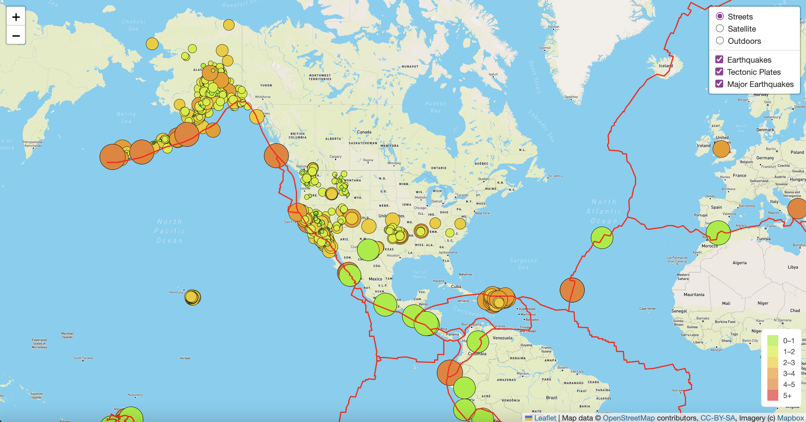

# Mapping Earthquakes

## Purpose

The purpose of this project is to create interactive maps using JSON data. The maps created will show earthquake activity in the last 7 days around the world, including the magnitude and location. We used JavaScript and the D3.js library to retrieve the coordinates and magnitudes of the earthquakes from the GeoJSON data.The Leaflet library was used to plot the data on a Mapbox map through an API request and and make the map interactive.

## Deliverables

The deliverables for the module challenge:

- Deliverable 1: Add Tectonic Plate Data
- Deliverable 2: Add Major Earthquake Data
- Deliverable 3: Add an Additional Map

### Deliverable 1

### Deliverable 2

### Deliverable 3

